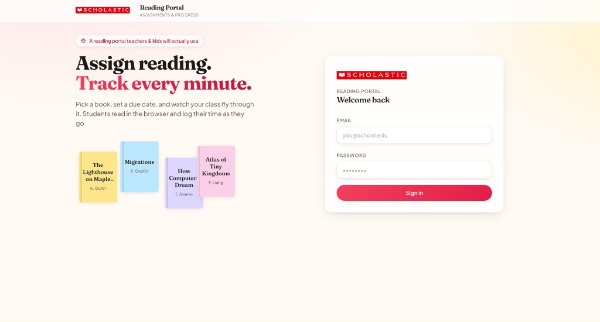

# Reading Portal — Scholastic Coding Challenge

Teachers pick a book and due date, assign one or more students, and see status plus minutes read. Students open the book in the app, log time (timer or manual), and update Not Started / In Progress / Completed.

**Stack:** Spring Boot 3.3 (Java 21) + React 18 (Vite, TypeScript, Tailwind)  
**Repo:** https://github.com/Emreyanmis/scholastic-reading-portal  
**Live app:** https://scholastic-reading-portal.vercel.app  
**API:** https://reading-portal-backend.onrender.com  

Deeper implementation notes: [`reading-portal/README.md`](./reading-portal/README.md)



### Demo logins (seeded; not shown on the login page)

| Role    | Email              | Password   |
| ------- | ------------------ | ---------- |
| Teacher | teacher@demo.com   | teacher123 |
| Student | alex@demo.com      | student123 |
| Student | jordan@demo.com    | student123 |
| Student | sam@demo.com       | student123 |

---

## Where things live in the repo

```
scholastic-reading-portal/
├── reading-portal/
│   ├── backend/          Spring Boot API
│   ├── frontend/         React SPA
│   └── render.yaml       Render blueprint
├── DEPLOY.md             Render + Vercel steps
└── vercel.json           optional Vercel monorepo hints
```

Backend packages under `com/scholastic/portal/`: `auth`, `domain`, `repo`, `web`, `seed`.

---

## Brief → code (quick map)

**Teacher**

| Requirement | Implementation |
| ----------- | -------------- |
| Book list | `BookController`, picker in `CreateAssignmentDialog` |
| Create assignment (book, due date, multiple students) | `POST /api/assignments` with `studentIds[]` |
| See assignments, status, minutes | `TeacherDashboardPage`, `AssignmentsTable` |

**Student**

| Requirement | Implementation |
| ----------- | -------------- |
| My assignments | `StudentDashboardPage` (scoped to logged-in student) |
| Read the book | `BookReader` + `GET /api/assignments/{id}` (full text in response) |
| Log minutes | Timer + manual entry → `POST /api/assignments/{id}/sessions` |
| Change status | `PATCH /api/assignments/{id}/status` |

Also: BCrypt passwords, signed `rp_session` cookie, `@AuthUser` for role checks, JPA on H2, validation on request DTOs. `minutesRead` on the assignment is updated in the same transaction as each `ReadingSession` row so the teacher list doesn't need a sum query.

---

## Run locally

JDK 21+, Node 18+. Maven wrapper is in `backend/`.

```bash
# backend (8081 — 8080 is often taken by Docker on a Mac)
cd reading-portal/backend
./mvnw spring-boot:run -Dspring-boot.run.arguments=--server.port=8081

# frontend
cd reading-portal/frontend
npm install && npm run dev   # http://localhost:5173
```

Vite proxies `/api` to the backend so cookies work without CORS in dev.

If `java` crashes on Apple Silicon (Rosetta / signature issues), from repo root:

```bash
export JAVA_HOME="$(pwd)/.tools/jdk-21.0.7+6/Contents/Home"
export PATH="$JAVA_HOME/bin:$PATH"
```

Local data: H2 file at `reading-portal/backend/data/portal.mv.db`. First boot runs `SeedRunner` for demo users/books.

---

## Deployed setup

Frontend on Vercel, API on Render (free tier). Walkthrough: **[DEPLOY.md](./DEPLOY.md)**.

- Vercel root: `reading-portal/frontend` — **do not** set `VITE_API_BASE` in prod; `/api` is proxied to Render via `vercel.json` so session cookies stay on your Vercel domain
- Render: blueprint `reading-portal/render.yaml`, Docker context `reading-portal/backend`
- Render env: `PORTAL_CORS_ORIGINS=https://scholastic-reading-portal.vercel.app`

`reading-portal-frontend.vercel.app` is not wired to this project — use the scholastic URL above for CORS and for reviewers.

Render sleeps after ~15 min idle; first hit after that can take ~30s. Prod uses in-memory H2, so demo data comes back from `SeedRunner` on cold start — assignments you create may disappear after a restart. Fine for the exercise; swap JDBC URL + disk or Postgres for real persistence.

---

## Design choices (short version)

Split **API + SPA** so each can deploy on its own (Render + Vercel here). JSON REST in the middle.

**One login, two dashboards.** Teachers and students share the same sign-in page (`LoginPage`); after `POST /api/auth/login` the API returns the user's role and the app routes to `/teacher` or `/student`. I didn't split into separate portals or URLs — same API, permissions from the account, not from which link you opened. For a district rollout I'd expect different entry URLs or SSO (Clever for students, staff SSO for teachers) while keeping one backend.

**Sessions:** small `SessionService` (HMAC cookie) instead of pulling in full Spring Security for a time-boxed build. Passwords are BCrypt. Prod cookies are `HttpOnly`, `Secure`, `SameSite=None` so Vercel can talk to Render with credentials.

**Auth in controllers:** `@AuthUser(requiredRole = …)` on parameters; `GlobalExceptionHandler` returns `{ "error": "…" }` for 401/403.

**Queries:** `open-in-view: false`, `@EntityGraph` on list endpoints to avoid N+1 and lazy-load surprises after the transaction ends.

**Minutes:** total on `Assignment` plus a `ReadingSession` row per log — easy teacher view, room for charts later.

**Status:** students can move between all three states; logging time bumps Not Started → In Progress when relevant. Didn't hard-lock a state machine.

---

## Assumptions I made

- Seeded accounts only — no signup. Production would likely be district SSO.
- One shared book catalog for all teachers.
- Same book can be assigned to the same student more than once.
- One create flow → one row per selected student (same book + due date).
- Minutes are self-reported (timer or typed).
- No classes/rosters — teacher sees every seeded student.
- Render free tier = ephemeral DB; local dev keeps a file.

---

## API

JSON everywhere. Errors: `{ "error": "message" }`.

| Method | Path | Who |
| ------ | ---- | --- |
| POST | `/api/auth/login` | — |
| POST | `/api/auth/logout` | — |
| GET | `/api/auth/me` | logged in |
| GET | `/api/health` | — (Render health check) |
| GET | `/api/books` | logged in |
| GET | `/api/students` | teacher |
| GET | `/api/assignments` | teacher: created; student: mine |
| POST | `/api/assignments` | teacher |
| GET | `/api/assignments/{id}` | teacher or assigned student |
| PATCH | `/api/assignments/{id}/status` | student |
| POST | `/api/assignments/{id}/sessions` | student |

---

## If I had more time

- Persistent DB — managed Postgres (or a Render disk + H2 file) so assignments survive redeploys and cold starts; prod is in-memory H2 on the free tier right now
- Tests (`@WebMvcTest`, a couple integration paths, Vitest / Playwright smoke flow)
- Spring Security or Clever/Google SSO
- Classes so teachers only see their roster
- Pagination and filters on the teacher table
- Charts from `ReadingSession` rows
- Flyway instead of `ddl-auto: update`
- CI on PRs

---

## Submission

- GitHub: link above  
- Live: https://scholastic-reading-portal.vercel.app — credentials in the table at the top  
- Write-up: this file + [`reading-portal/README.md`](./reading-portal/README.md)
